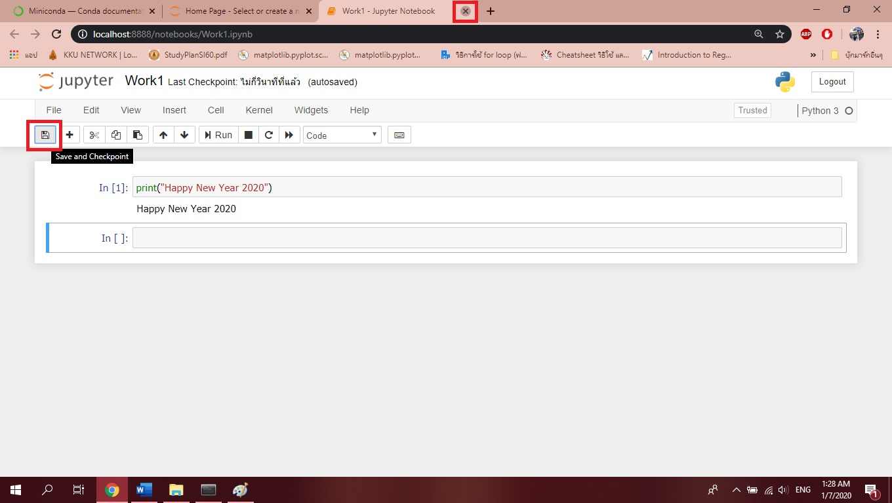
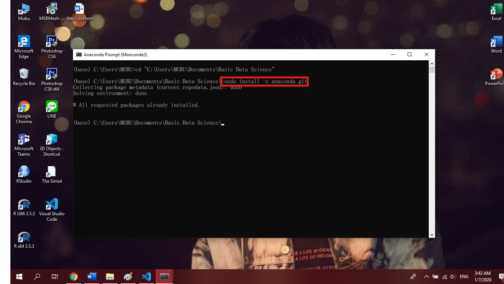
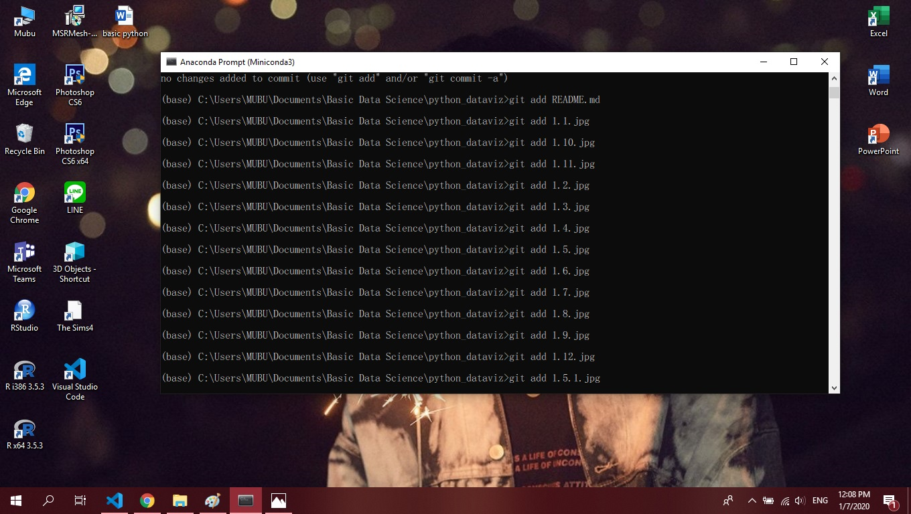

## 603021882-9 นางสาวมุทิตา บุตะเขียว

### 1. วิธีติดตั้ง Python
    1.1) ค้นหา Miniconda ใน google โดยโปรแกรมหลักจะมีชื่อว่า Anaconda แต่เนื่องจาก Anaconda มีขนาดใหญ่มากเกินไปและอาจจะมีบาง package ที่ไม่ได้ใช้ ดังนั้นจึงมีการ download Miniconda แทน โดยที่ Miniconda นั้นคือ Anaconda แบบเล็ก ๆ

	1.2) เลือกชนิดของ computer, version และ system type ที่จะติดตั้ง

	1.3) เมื่อติดตั้ง Miniconda เรียบร้อยแล้ว ให้ click ที่ start จากนั้นเลือก click ที่ Anaconda Prompt

	1.4) ทำการ check version และดูว่า python ที่ติดตั้งสามารถใช้งานได้หรือไม่ โดยการพิมพ์ python

	1.5) ทำการทดสอบคำสั่งใน python ด้วยคำสั่ง print

		1.5.1) พิมพ์ exit() เพื่อออก
    
    1.6) เมื่อต้องการ install library ที่ต้องการ สามารถทำได้โดยการพิมพ์ conda install และตามด้วยชื่อ library ที่ต้องการ โดย library หลักที่ใช้ในการทำงาน คือ jupyter notebook ดังนั้นจึงต้องทำการติดตั้ง jupyter noteboo

        1.6.1) เมื่อ run เสร็จเรียบร้อยแล้วให้พิมพ์ y และรอสักครู่ก็เป็นอันเสร็จ
    
    1.7) ก่อนที่จะเปิดใช้งาน jupyter notebook ได้นั้นต้องสร้าง folder เพื่อไว้จัดเก็บงาน และเมื่อสร้างเสร็จแล้วให้ click เข้า folder แล้ว copy ที่อยู่ของ folder นั้นไว้ดังนี้

    1.8) กลับมาที่ Anaconda Prompt พิมพ์ cd เว้นวรรค และตามด้วย “ ” โดยที่ข้างใน “ ”  เป็นที่อยู่ของ folder ที่ copy ไว้ในขั้นตอนก่อนหน้า จากนั้น enter และพิมพ์ jupyter notebook และกด enter อีกครั้ง

    1.9) จากนั้น web browser จะเด้งขึ้นมาหน้าตาดังต่อไปนี้
    
    1.10) สามารถสร้าง file และเริ่มทำงานด้วยการ click ที่ New และเลือกที่ Python3
 
    1.11) เมื่อทำงานเสร็จสามารถกด save และกากบาทออกได้เลย
 
    1.12) กลับมาที่หน้า home click เลือก file ที่เพิ่งทำงานเสร็จไป ทำการ click shoutdown จากนั้นกลับไปที่ Anaconda Prompt และ Ctrl+C เป็นอันจบการทำงาน
 

### 2. วิธีใช้ jupyter notebook บน Cloud หรือที่เรียกว่า Colab โดยมีข้อเสีย คือ มีความลำบากตอนย้าย file และต้องใช้ internet ตลอดเวลา
    2.1) พิมพ์ Colab ลงบน google และเลือก google colab
 
    2.2) เมื่อ click เข้ามาแล้ว ให้ Sign in เข้าระบบเพื่อเริ่มใช้งาน
 
    2.3) เมื่อเข้าสู่ระบบแล้วให้ click NEW PYTHON 3 NOTEBOOK
 
    2.4) สามารถเริ่มใช้งานด้วยการพิมพ์ import pandas และ run คำสั่งด้วยการกด shift ค้างไว้ ตามด้วย enter 
 
    2.5) สามารถตั้งค่า theme และให้มีน้องหมาน้องแมววิ่งเล่นได้ที่ icon setting เมื่อตั้งค่าเสร็จให้ click SAVE

### 3. วิธีใช้ GitHub
    3.1) พิมพ์ github.com ลงบน browser โดยหน้าตาของ GitHub จะเป็นดังภาพ จากนั้น click Sign in

    3.2) เมื่อ Sign in เข้ามาแล้วให้ทำการ click NEW เพื่อสร้าง Project
   
	3.3) ทำการตั้งชื่อ Project เลือกเป็นแบบสาธารณะ และ click หน้า Initialize this repository with a READNE จากนั้น click Create repository
 
    3.4) เปิด Anaconda Prompt และทำการ install anaconda ลงใน git ด้วยการพิมพ์ conda install -c anaconda git
 
    3.5) กลับเข้า GitHub แล้ว click ที่ Clone or download เพื่อ copy url Project
 
    3.6) เปิด Anaconda Prompt ขึ้นมา จากนั้นพิมพ์ git clone ตามด้วย url Project ที่ copy มา เพื่อเชื่อม code ที่อยู่ในเครื่องกับที่อยู่บน internet
 
    3.7) ใช้คำสั่ง dir เพื่อดูว่ามี file git ที่สร้างไว้หรือไม่

    3.8) จากนั้นลาก file ที่จะใช้เข้า file git และพิมพ์ dir ใน Anaconda Prompt อีกครั้งเพื่อตรวจสอบว่า file ที่ดึงเข้ามามีหรือยัง

    3.9) ดูว่า file ใหม่ที่เพิ่งย้ายเข้ามาเชื่อกับ internet หรือไม่ ด้วยการพิมพ์ git status

    3.10) add file ให้เชื่อมกับ git ด้วยการพิมพ์คำสั่ง git add และตามด้วยชื่อ file

    3.11) ตรวจสอบว่า file ที่ทำการ add เข้ามา มีอะไรบ้าง ด้วยการพิมพ์คำสั่ง git commit -m “test git”

    3.12) ทำการดัน file ขึ้น GitHub ด้วยการพิมพ์คำสั่ง git push
